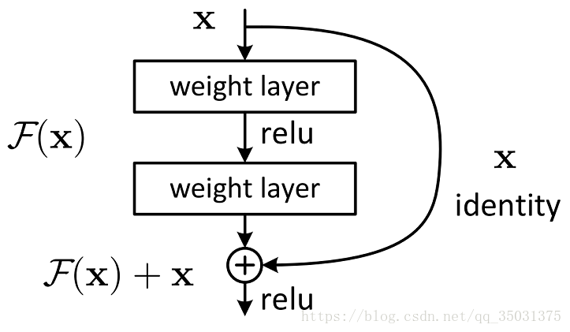

## Resnet

#### 文章
《Deep Residual Learning for Image Recognition》
 2015，kaiming He et al，ResNet。

##### 参考博客

> https://blog.csdn.net/u013841196/article/details/80713314
>
> https://www.jianshu.com/p/93990a641066
>
> https://blog.csdn.net/weixin_43624538/article/details/85049699

#### 简介
使用Residual Unit成功训练152层深的神经网络

3.57%的top5错误率

参数量却比VGG Net低，效果非常突出

**ResNet最初的灵感出自这个问题**：在不断增加神经网络的深度时，会出现一个**Degradation（退化）**的问题，即准确率会先上升然后达到饱和，再持续增加深度则会导致准确率下降。这并不是过拟合的问题，因为不光在测试集上误差增大，训练集本身误差也会增大。

假设有一个比较浅的网络达到了饱和的准确率，那么后面再加上几个y=x的全等映射层，起码误差不会增加，即更深的网络不应该带来训练集上误差上升。

而这里提到的使用全等映射直接将前一层输出传到后面的思想，就是ResNet的灵感来源。

#### emm

假定某段神经网络的输入是x，期望输出是H(x)，如果我们直接把输入x传到输出作为初始结果，那么此时我们需要学习的目标就是F(x) = H(x) - x。如图所示，这就是一个ResNet的**残差学习单元**（Residual Unit）



ResNet相当于将学习目标改变了，不再是学习一个完整的输出H(x)，只是输出和输入的差别H(x)-x，即残差

F(x)=H(x)−x，x为浅层的输出，H(x)为深层的输出,F(x)为夹在二者中间的的两层代表的变换。

当浅层的x代表的特征已经足够成熟，如果任何对于特征xxx的改变都会让loss变大的话，F(x)会自动趋向于学习成为0，xxx则从恒等映射的路径继续传递。

这样就在不增加计算成本的情况下实现了一开始的目的：在前向过程中，当浅层的输出已经足够成熟（optimal），让深层网络后面的层能够实现恒等映射的作用。

residual模块将输出分成F(x)+x两部分，其中F依然是x的函数，也就是说F实际上是对于x的补充，是对于x的fun-tuning，

这样就把任务从根据x映射成一个新的y转为了根据x求x和y之间的差距，这明显是一个相对更加简单的任务


#### 代码

直接用的：

```python
#!/usr/bin/env python
# -*- coding: utf-8 -*-
# @Time : 2019/10/23 16:56
# @Author : zui
# @File : resnet_sample1.py

import torch
import numpy as np
import torchvision
from torchvision import transforms, utils
from torch.utils.data import DataLoader
from torch.autograd import Variable

# perpare data set
# train data
train_data = torchvision.datasets.ImageFolder('./data/train', transform=transforms.Compose(
    [
        transforms.Resize(500),
        transforms.CenterCrop(224),
        transforms.ToTensor()
    ]))
print(len(train_data))
train_loader = DataLoader(train_data, batch_size=15, shuffle=True)

# test data
test_data = torchvision.datasets.ImageFolder('./data/test', transform=transforms.Compose(
    [
        transforms.Resize(500),
        transforms.CenterCrop(224),
        transforms.ToTensor()
    ]))
print(len(test_data))
test_loader = DataLoader(test_data, batch_size=5, shuffle=True)

# prepare model
mode1_ft_res18 = torchvision.models.resnet18(pretrained=True)
# pretrained 设置为 True，会自动下载模型 所对应权重，并加载到模型中
for param in mode1_ft_res18.parameters():
    param.requires_grad = False
# 假设我们的分类任务只需要分 4类，那么我们应该做的是
# 1. 查看 resnet 的源码
# 2. 看最后一层的 名字是啥 （在 resnet 里是 self.fc = nn.Linear(512 * block.expansion, num_classes)）
# 3. 在外面替换掉这个层

num_fc = mode1_ft_res18.fc.in_features

# 只定义了一个全连接层，4是类别个数
# 修改后的模型除了输出层的参数是 随机初始化的，其他层都是用预训练的参数初始化的
mode1_ft_res18.fc = torch.nn.Linear(num_fc, 4)

'''
# 如果只想训练 最后一层的话，应该做的是：
# 1. 将其它层的参数 requires_grad 设置为 False
# 2. 构建一个 optimizer， optimizer 管理的参数只有最后一层的参数
# 3. 然后 backward， step 就可以了

# 这一步可以节省大量的时间，因为多数的参数不需要计算梯度
for para in list(resnet_model.parameters())[:-1]:
    para.requires_grad=False 

optimizer = optim.SGD(params=[resnet_model.fc.weight, resnet_model.fc.bias], l

'''

# loss function and optimizer
criterion = torch.nn.CrossEntropyLoss()
# parameters only train the last fc layer
optimizer = torch.optim.Adam(mode1_ft_res18.fc.parameters(), lr=0.001)

# start train
# label  not  one-hot encoder
EPOCH = 10
for epoch in range(EPOCH):
    train_loss = 0.
    train_acc = 0.
    for step, data in enumerate(train_loader):
        batch_x, batch_y = data
        batch_x, batch_y = Variable(batch_x), Variable(batch_y)
        # batch_y not one hot
        # out is the probability of eatch class
        # such as one sample[-1.1009  0.1411  0.0320],need to calculate the max index
        # out shape is batch_size * class
        out = mode1_ft_res18(batch_x)
        loss = criterion(out, batch_y)
        train_loss += loss.item()
        # pred is the expect class
        # batch_y is the true label
        pred = torch.max(out, 1)[1]
        train_correct = (pred == batch_y).sum()
        train_acc += train_correct.item()
        optimizer.zero_grad()
        loss.backward()
        optimizer.step()
        if step % 14 == 0:
            print('Epoch: ', epoch, 'Step', step,
                  'Train_loss: ', train_loss / ((step + 1) * 20), 'Train acc: ', train_acc / ((step + 1) * 20))

    # print('Epoch: ', epoch, 'Train_loss: ', train_loss / len(train_data), 'Train acc: ', train_acc / len(train_data))

# test model
mode1_ft_res18.eval()
eval_loss = 0
eval_acc = 0
for step, data in enumerate(test_loader):
    batch_x, batch_y = data
    batch_x, batch_y = Variable(batch_x), Variable(batch_y)
    out = mode1_ft_res18(batch_x)
    loss = criterion(out, batch_y)
    eval_loss += loss.item()
    # pred is the expect class
    # batch_y is the true label
    pred = torch.max(out, 1)[1]
    test_correct = (pred == batch_y).sum()
    eval_acc += test_correct.item()
    optimizer.zero_grad()
    loss.backward()
    optimizer.step()
print('Test_loss: ', eval_loss / len(test_data), 'Test acc: ', eval_acc / len(test_data))
```


> https://blog.csdn.net/u014380165/article/details/79119664
>
> https://blog.csdn.net/fortilz/article/details/80851251
>
> https://blog.csdn.net/Jason_mmt/article/details/82661376
>
> https://blog.csdn.net/qq_31347869/article/details/100566719

```python
#!/usr/bin/env python
# -*- coding: utf-8 -*-
# @Time : 2019/10/23 17:18
# @Author : zui
# @File : torchvision_model.py


import torch.nn as nn
import math
import torch.utils.model_zoo as model_zoo

class ResNet(nn.Module):

    def __init__(self, block, layers, num_classes=1000):
        self.inplanes = 64
        super(ResNet, self).__init__()
        self.conv1 = nn.Conv2d(3, 64, kernel_size=7, stride=2, padding=3,
                               bias=False)
        self.bn1 = nn.BatchNorm2d(64)
        self.relu = nn.ReLU(inplace=True)
        self.maxpool = nn.MaxPool2d(kernel_size=3, stride=2, padding=1)
        self.layer1 = self._make_layer(block, 64, layers[0])
        self.layer2 = self._make_layer(block, 128, layers[1], stride=2)
        self.layer3 = self._make_layer(block, 256, layers[2], stride=2)
        self.layer4 = self._make_layer(block, 512, layers[3], stride=2)
        self.avgpool = nn.AvgPool2d(7, stride=1)
        self.fc = nn.Linear(512 * block.expansion, num_classes)

        for m in self.modules():
            if isinstance(m, nn.Conv2d):
                n = m.kernel_size[0] * m.kernel_size[1] * m.out_channels
                m.weight.data.normal_(0, math.sqrt(2. / n))
            elif isinstance(m, nn.BatchNorm2d):
                m.weight.data.fill_(1)
                m.bias.data.zero_()

    '''
    另外还可以在类中定义其他私有方法用来模块化一些操作
    _make_layer方法是用来构建ResNet网络中的4个blocks。
    _make_layer方法的第一个输入block是Bottleneck或BasicBlock类，
    第二个输入是该blocks的输出channel，第三个输入是每个blocks中包含多少个residual子结构，
    因此layers这个列表就是前面resnet50的[3, 4, 6, 3]

    '''
    def _make_layer(self, block, planes, blocks, stride=1):
        downsample = None
        if stride != 1 or self.inplanes != planes * block.expansion:
            downsample = nn.Sequential(
                nn.Conv2d(self.inplanes, planes * block.expansion,
                          kernel_size=1, stride=stride, bias=False),
                nn.BatchNorm2d(planes * block.expansion),
            )

        layers = []
        # 将每个blocks的第一个residual结构保存在layers列表中
        layers.append(block(self.inplanes, planes, stride, downsample))
        self.inplanes = planes * block.expansion
        # 将每个blocks的剩下residual 结构保存在layers列表中，这样就完成了一个blocks的构造
        for i in range(1, blocks):
            layers.append(block(self.inplanes, planes))

        return nn.Sequential(*layers)

    # forward方法中主要是定义数据在层之间的流动顺序，也就是层的连接顺序
    def forward(self, x):
        x = self.conv1(x)
        x = self.bn1(x)
        x = self.relu(x)
        x = self.maxpool(x)

        x = self.layer1(x)
        x = self.layer2(x)
        x = self.layer3(x)
        x = self.layer4(x)

        x = self.avgpool(x)
        x = x.view(x.size(0), -1)
        x = self.fc(x)

        return x

# Bottleneck是另外一个构建bottleneck的类，在ResNet网络结构的构建中有很多重复的子结构，这些子结构就是通过Bottleneck类来构建的
# 在resnet50、resnet101、resnet152中调用的是Bottleneck类
# 在resnet18和resnet34中调用的是BasicBlock类
# 这两个类的区别主要是在residual结果中卷积层的数量不同
# ResNet是由residual结构组成的，而Bottleneck类就是完成residual结构的构建

class Bottleneck(nn.Module):
    expansion = 4
    # inplanes是输入通道数，planes是输出通道数 / expansion，expansion是对输出通道数的倍乘，
    # 注意在基础版本BasicBlock中expansion是1，此时相当于没有倍乘，输出的通道数就等于planes。
    # 在使用 Bottleneck 时，它先对通道数进行压缩，再放大，所以传入的参数 planes 不是实际输出的通道数，
    # 而是 block 内部压缩后的通道数，真正的输出通道数为 plane*expansion

    def __init__(self, inplanes, planes, stride=1, downsample=None):
        super(Bottleneck, self).__init__()
        self.conv1 = nn.Conv2d(inplanes, planes, kernel_size=1, bias=False)
        self.bn1 = nn.BatchNorm2d(planes)
        self.conv2 = nn.Conv2d(planes, planes, kernel_size=3, stride=stride,
                               padding=1, bias=False)
        self.bn2 = nn.BatchNorm2d(planes)
        self.conv3 = nn.Conv2d(planes, planes * 4, kernel_size=1, bias=False)
        self.bn3 = nn.BatchNorm2d(planes * 4)
        self.relu = nn.ReLU(inplace=True)
        self.downsample = downsample
        self.stride = stride

    # def __init__(self, inplanes, planes, stride=1, downsample=None, groups=1,
    #              base_width=64, dilation=1, norm_layer=None):
    #     super(Bottleneck, self).__init__()
    #     if norm_layer is None:
    #         norm_layer = nn.BatchNorm2d
    #     width = int(planes * (base_width / 64.)) * groups
    #     # Both self.conv2 and self.downsample layers downsample the input when stride != 1
    #     self.conv1 = conv1x1(inplanes, width)
    #     self.bn1 = norm_layer(width)
    #     self.conv2 = conv3x3(width, width, stride, groups, dilation)
    #     self.bn2 = norm_layer(width)
    #     self.conv3 = conv1x1(width, planes * self.expansion)
    #     self.bn3 = norm_layer(planes * self.expansion)
    #     self.relu = nn.ReLU(inplace=True)
    #     self.downsample = downsample
    #     self.stride = stride


    # 可看出bottleneck就是我们熟悉的3个主要的卷积层、BN层和激活层，最后的out += residual就是element-wise add的操作。
    def forward(self, x):
        residual = x

        out = self.conv1(x)
        out = self.bn1(out)
        out = self.relu(out)

        out = self.conv2(out)
        out = self.bn2(out)
        out = self.relu(out)

        out = self.conv3(out)
        out = self.bn3(out)

        if self.downsample is not None:
            residual = self.downsample(x)

        out += residual
        out = self.relu(out)

        return out

def conv1x1(in_planes, out_planes, stride=1):
    """1x1 convolution"""
    return nn.Conv2d(in_planes, out_planes, kernel_size=1, stride=stride, bias=False)

def conv3x3(in_planes, out_planes, stride=1):
    """3x3 convolution with padding"""
    return nn.Conv2d(in_planes, out_planes, kernel_size=3, stride=stride,
                     padding=1, bias=False)

class BasicBlock(nn.Module):
    expansion = 1

    def __init__(self, inplanes, planes, stride=1, downsample=None):
        super(BasicBlock, self).__init__()
        self.conv1 = conv3x3(inplanes, planes, stride)
        self.bn1 = nn.BatchNorm2d(planes)
        self.relu = nn.ReLU(inplace=True)
        self.conv2 = conv3x3(planes, planes)
        self.bn2 = nn.BatchNorm2d(planes)
        self.downsample = downsample
        self.stride = stride

    # 该类中，第一个卷积层采用的是kernel_size=3的卷积，如conv3x3函数所示。
    def forward(self, x):
        residual = x

        out = self.conv1(x)
        out = self.bn1(out)
        out = self.relu(out)

        out = self.conv2(out)
        out = self.bn2(out)

        # 在进行下采样，如果需要的话
        if self.downsample is not None:
            residual = self.downsample(x)

        out += residual         # ResNet 的精髓，在输出上叠加了输入 xx

        out = self.relu(out)

        return out


__all__ = ['ResNet', 'resnet18', 'resnet34', 'resnet50', 'resnet101',
           'resnet152']

model_urls = {
    'resnet18': 'https://download.pytorch.org/models/resnet18-5c106cde.pth',
    'resnet34': 'https://download.pytorch.org/models/resnet34-333f7ec4.pth',
    'resnet50': 'https://download.pytorch.org/models/resnet50-19c8e357.pth',
    'resnet101': 'https://download.pytorch.org/models/resnet101-5d3b4d8f.pth',
    'resnet152': 'https://download.pytorch.org/models/resnet152-b121ed2d.pth',
}

def resnet50(pretrained=False, **kwargs):
    """Constructs a ResNet-50 model.

    Args:
        pretrained (bool): If True, returns a model pre-trained on ImageNet
    """
    model = ResNet(Bottleneck, [3, 4, 6, 3], **kwargs)
    if pretrained:
        model.load_state_dict(model_zoo.load_url(model_urls['resnet50']))
    return model

def resnet18(pretrained=False, **kwargs):
    """Constructs a ResNet-18 model.

    Args:
        pretrained (bool): If True, returns a model pre-trained on ImageNet
    """
    # 如果参数pretrained是True，那么就会通过model_zoo.py中的load_url函数根据model_urls字典下载或导入相应的预训练模型
    # 最后通过调用model的load_state_dict方法用预训练的模型参数来初始化你构建的网络结构，
    # 这个方法就是PyTorch中通用的用一个模型的参数初始化另一个模型的层的操作
    model = ResNet(BasicBlock, [2, 2, 2, 2], **kwargs)
    if pretrained:
        model.load_state_dict(model_zoo.load_url(model_urls['resnet18']))
    return model

def resnet101(pretrained=False, **kwargs):
    """Constructs a ResNet-101 model.

    Args:
        pretrained (bool): If True, returns a model pre-trained on ImageNet
    """
    model = ResNet(Bottleneck, [3, 4, 23, 3], **kwargs)
    if pretrained:
        model.load_state_dict(model_zoo.load_url(model_urls['resnet101']))
    return model

def resnet34():
    pass

def resnet152():
    pass


```


