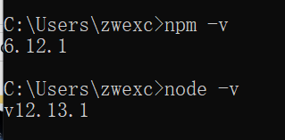
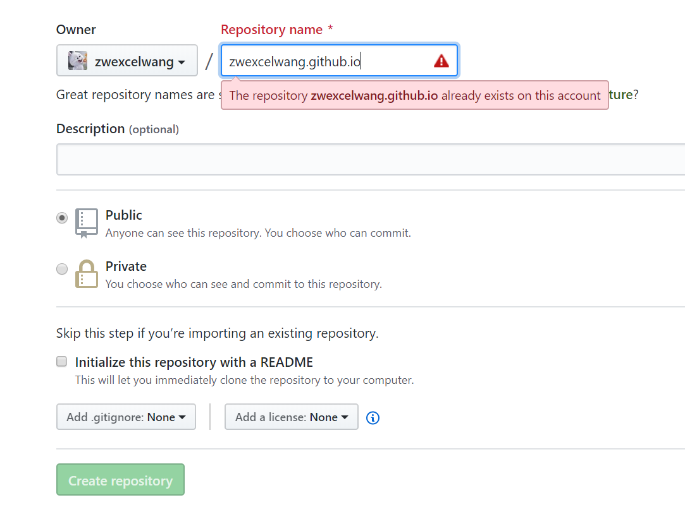
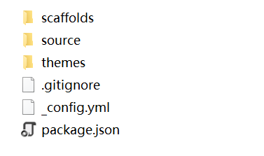
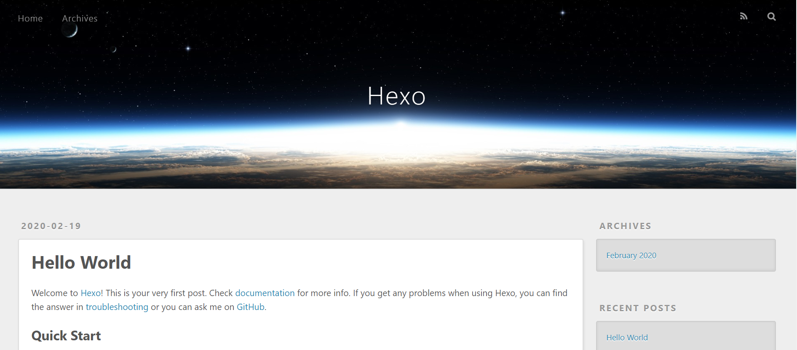
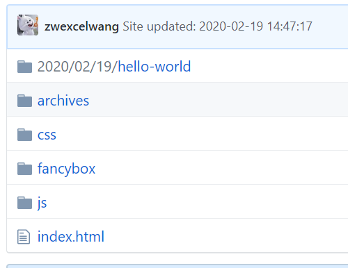
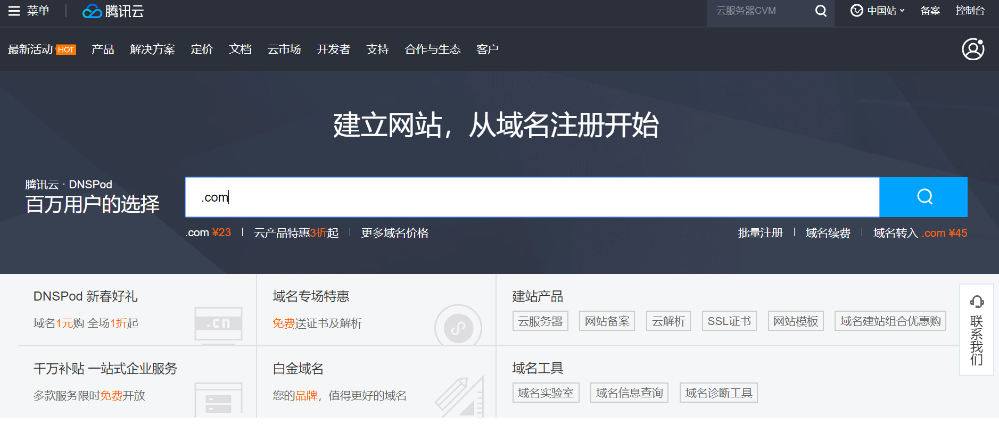
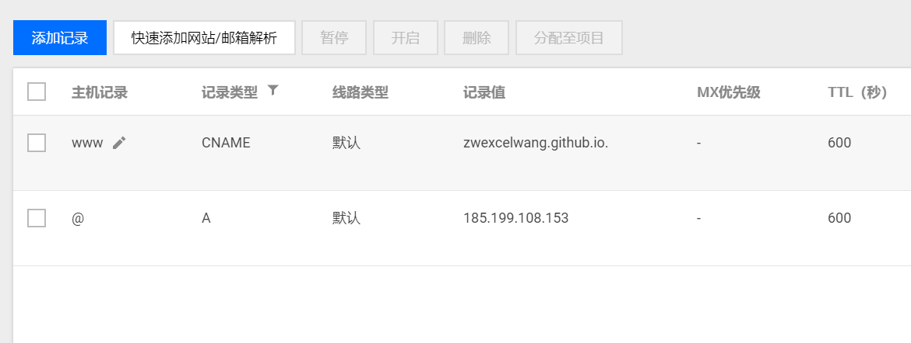
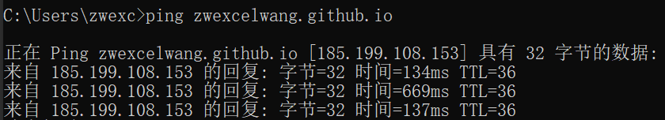
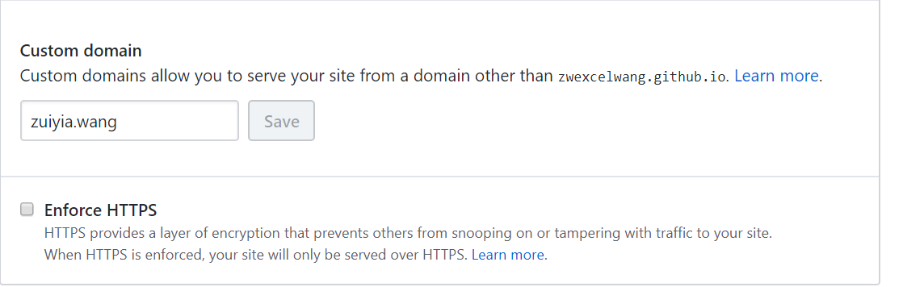

# 用Hexo+Github搭建个人博客

> 在搭建过程中踩坑无数，写个博客记录一下最后实验成功的教程
>
> 参考链接：
>
>  https://www.cnblogs.com/liuxianan/p/build-blog-website-by-hexo-github.html 
>
>  https://www.jianshu.com/p/c7397489757c 


## 1. 安装node.js

 [下载链接](https://nodejs.org/zh-cn/download/ ) 

下载好安装包之后一路next就行

命令行测试



## 2. 安装git

 [下载链接](https://git-scm.com/downloads ) 

下载好后直接安装，随便找个地方右键看这两个有没有


## 3. 注册github，配置SSH，新建仓库

[Github官网](https://github.com/ )注册一个账号 

配置ssh的步骤可以[参考链接](https://www.cnblogs.com/MrReed/p/6373988.html)

在github新建仓库username.github.io(此处username是你github的用户名)



我已经创建过了所以显示already exists

## 4. 搭建

### 4.1 在本地新建一个空文件夹

例如我为了方便，文件夹命名为zwexcelwang.github.io（跟github仓库同名，以后我就不会忘里面放的文件是什么了）

### 4.2 安装和初始化hexo

右键选择git Bash打开

```shell
# 安装hexo
npm install -g hexo
```

安装完成后输入

一般来说下面这个命令会运行很慢，可以换npm的源，参考链接

```shell
hexo init
```

文件夹中会出现这些文件



安装依赖

```shell
npm install
```

安装完后本地运行一下，hexo命令不知道含义可以[参考链接](https://www.cnblogs.com/wsmrzx/p/9439448.html)

```shell
hexo g 
hexo s
```

在网页输入下网址查看是否出现页面

```
http://localhost:4000
```




### 4.3 部署到github

修改文件 **_config.yml** 的**deploy**部分

```
deploy:
  type: git
  repository: git@github.com:zwexcelwang/zwexcelwang.github.io.git
  branch: master
```

Git Bash命令行安装

```shell
npm install hexo-deployer-git --save
```

然后

```shell
hexo d
```

若报以下错误，[参考链接](https://blog.csdn.net/njc_sec/article/details/89021083)

```shell
Error: Spawn failed
```

部署完成后可在github仓库中看到



在浏览器输入username.github.io测试是否能看见hexo的网页

## 5. 绑定域名

### 5.1 去买一个域名

阿里云，腾讯云这些都行，我买的是[腾讯云](https://cloud.tencent.com/)的，在云产品找到域名注册

然后搜索想要的域名，例如.com



买好之后要实名认证，按照步骤就行，大概要等半天左右的时间就好啦

### 5.2 域名解析

在我的域名里找到自己的域名，填写解析



主机记录为@那行的记录值就是你github的ip，在命令行

```shell
ping username.github.io
```

得到：



### 5.3 绑定域名

在github的仓库username.github.io右侧的setting填写买好的域名



在username.github.io文件夹下的source文件夹里新建一个没有后缀的文件，命名为**CNAME**

文件里写买好的域名，比如我的是

```
zuiyia.wang
```

然后生成并上传

```shell
hexo g
hexo d
```

然后在浏览器输入你的域名就可以看见博客啦


如何使用hexo写博客，这些还没有学，等我学了再写教程